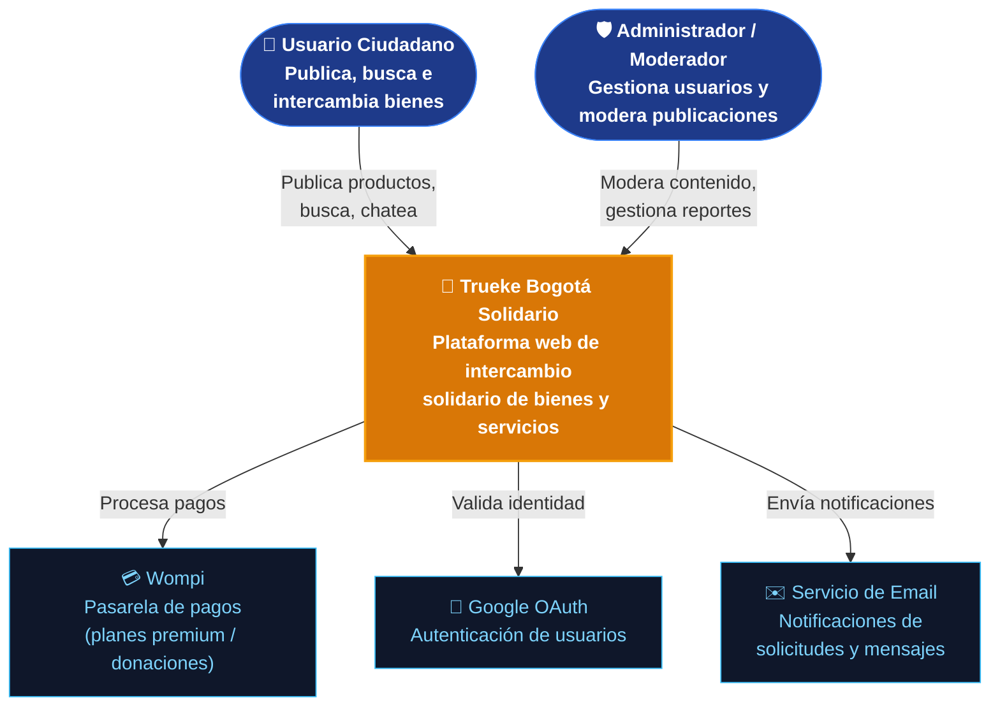
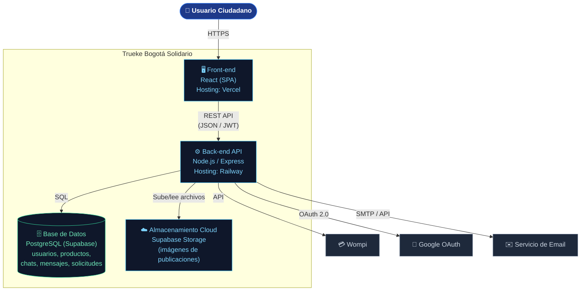
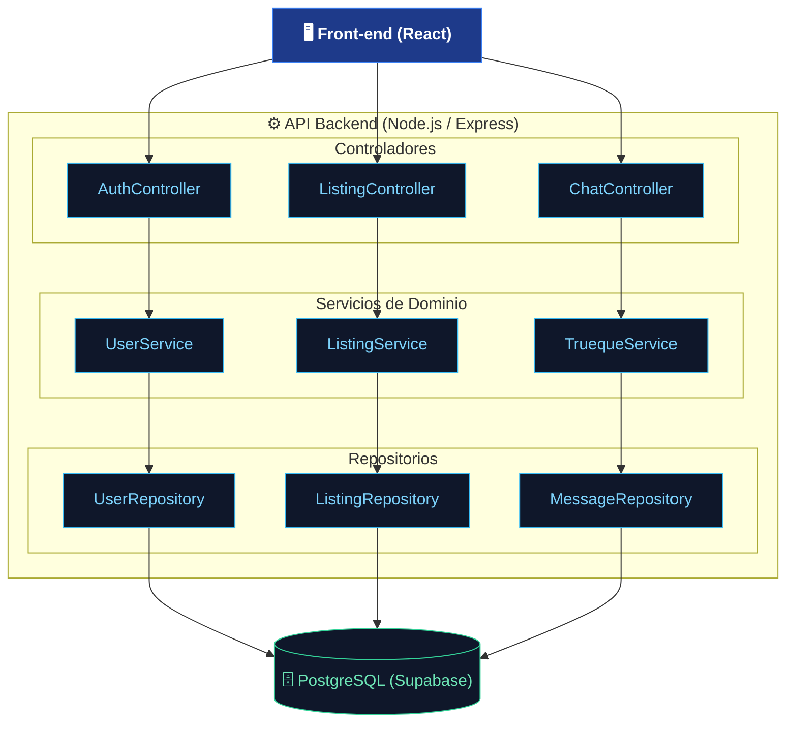
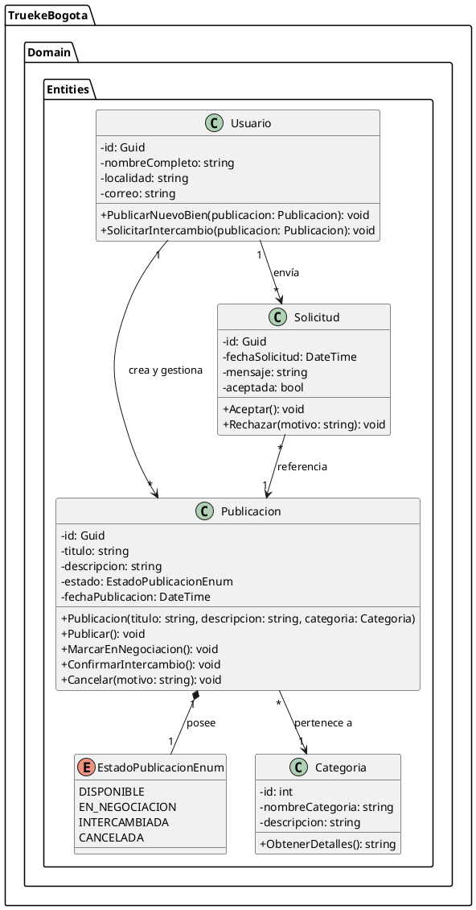

# Modelado C4 — Trueke Bogotá Solidario

Laboratorio ACA aplicado al proyecto de cátedra "Trueke Bogotá Solidario".

---

## Nivel 1 — Contexto

Arquetipos de usuario: **Usuario Ciudadano** y **Administrador/Moderador**.
Sistemas externos: **Wompi** (pasarela de pagos) y **Google OAuth** (autenticación), más un servicio de **Email** para notificaciones.

---

## Nivel 2 — Contenedores

Componentes ejecutables del sistema: Front-end, Back-end, Base de Datos y almacenamiento Cloud.

---

## Nivel 3 — Componentes (dentro del contenedor API Backend)

---

## Nivel 4 — Código (PlantUML)

Entidad de dominio principal: **Publicacion** (equivalente a "OfertaAgricola" del ejemplo de referencia, pero aplicada al dominio de trueke).

Archivo a crear en VS Code: `Nivel4_Codigo.puml`

### Pasos en VS Code
1. Instalar la extensión **PlantUML** (autor: jebbs).
2. Crear el archivo `Nivel4_Codigo.puml` dentro del repositorio, en una carpeta `docs/c4/`.
3. Pegar el código de arriba.
4. Presionar **Alt + D** para previsualizar en tiempo real.
5. Clic derecho sobre la previsualización → **Export Current Diagram** → `.png` o `.svg`.
6. Guardar el export dentro de `docs/c4/` junto al `.puml`.

---

## Vinculación con Trello / Azure Boards

Crear una tarjeta llamada **"Diseño de Arquitectura C4 - Hito ACA"** con:
- Enlace a este archivo en GitHub (una vez subido).
- Capturas de pantalla de los diagramas de Nivel 1, 2 y 3 (renderízalos en [mermaid.live](https://mermaid.live) y exporta como PNG).
- Captura del diagrama de Nivel 4 exportado desde VS Code.
