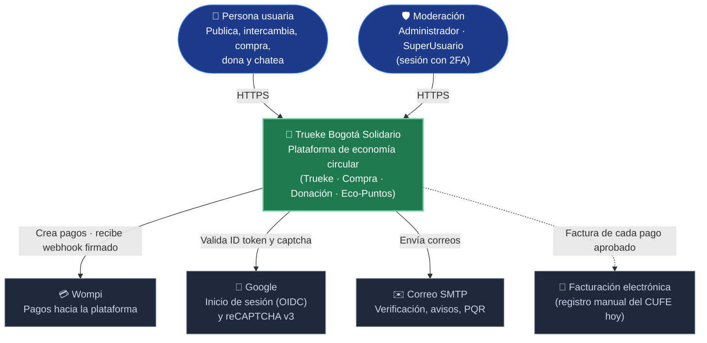
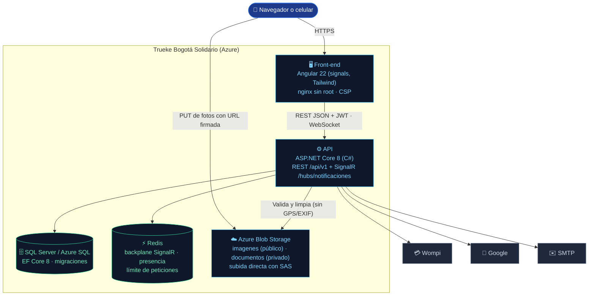
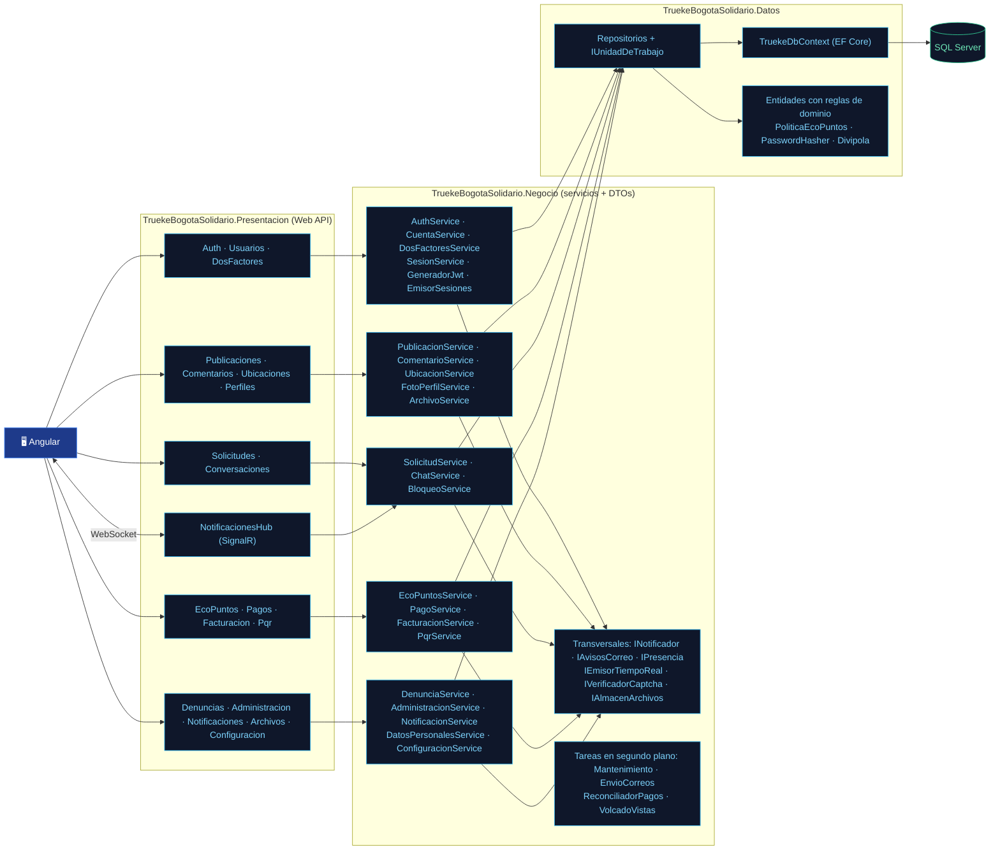
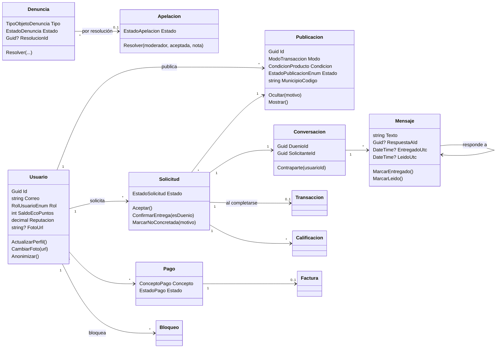

# Modelo C4 — Trueke Bogotá Solidario

Fuente de verdad de la arquitectura. Los diagramas están en Mermaid (GitHub los dibuja solos; también se pueden abrir en [mermaid.live](https://mermaid.live)).
Si cambia la arquitectura, se actualiza este archivo en el mismo Pull Request.

> El modelo de la etapa académica (React/Node) quedó archivado en `docs/historico/c4-etapa-academica/`.

---

## Nivel 1 — Contexto

```mermaid
flowchart TB
    U1(["👤 Persona usuaria<br/>Publica, intercambia, compra,<br/>dona y chatea"]):::persona
    U2(["🛡️ Moderación<br/>Administrador · SuperUsuario<br/>(sesión con 2FA)"]):::persona

    SYS["🔄 Trueke Bogotá Solidario<br/>Plataforma de economía circular<br/>(Trueke · Compra · Donación · Eco-Puntos)"]:::system

    WOMPI["💳 Wompi<br/>Pagos hacia la plataforma"]:::externo
    GOOGLE["🔐 Google<br/>Inicio de sesión (OIDC)<br/>y reCAPTCHA v3"]:::externo
    SMTP["✉️ Correo SMTP<br/>Verificación, avisos, PQR"]:::externo
    DIAN["🧾 Facturación electrónica<br/>(registro manual del CUFE hoy)"]:::externo

    U1 -->|"HTTPS"| SYS
    U2 -->|"HTTPS"| SYS
    SYS -->|"Crea pagos · recibe webhook firmado"| WOMPI
    SYS -->|"Valida ID token y captcha"| GOOGLE
    SYS -->|"Envía correos"| SMTP
    SYS -.->|"Factura de cada pago aprobado"| DIAN

    classDef persona fill:#1e3a8a,color:#fff,stroke:#3b82f6;
    classDef system fill:#1f7a4d,color:#fff,stroke:#7bcfa3,stroke-width:2px;
    classDef externo fill:#1e293b,color:#cbd5e1,stroke:#64748b;
```

---

## Nivel 2 — Contenedores

```mermaid
flowchart TB
    U(["👤 Navegador o celular"]):::persona

    subgraph SYS["Trueke Bogotá Solidario (Azure)"]
        direction TB
        FE["🖥️ Front-end<br/>Angular 22 (signals, Tailwind)<br/>nginx sin root · CSP"]:::contenedor
        API["⚙️ API<br/>ASP.NET Core 8 (C#)<br/>REST /api/v1 + SignalR /hubs/notificaciones"]:::contenedor
        DB[("🗄️ SQL Server / Azure SQL<br/>EF Core 8 · migraciones")]:::datos
        REDIS[("⚡ Redis<br/>backplane SignalR · presencia<br/>límite de peticiones")]:::datos
        BLOB["☁️ Azure Blob Storage<br/>imagenes (público) · documentos (privado)<br/>subida directa con SAS"]:::contenedor
    end

    WOMPI["💳 Wompi"]:::externo
    GOOGLE["🔐 Google"]:::externo
    SMTP["✉️ SMTP"]:::externo

    U -->|"HTTPS"| FE
    U -->|"PUT de fotos con URL firmada"| BLOB
    FE -->|"REST JSON + JWT · WebSocket"| API
    API --> DB
    API --> REDIS
    API -->|"Valida y limpia (sin GPS/EXIF)"| BLOB
    API --> WOMPI
    API --> GOOGLE
    API --> SMTP

    classDef persona fill:#1e3a8a,color:#fff,stroke:#3b82f6;
    classDef contenedor fill:#0f172a,color:#7dd3fc,stroke:#38bdf8;
    classDef datos fill:#0f172a,color:#6ee7b7,stroke:#34d399;
    classDef externo fill:#1e293b,color:#cbd5e1,stroke:#64748b;
```

**Seguridad entre contenedores:** el token de acceso (JWT, 15 min) vive en memoria del navegador; la renovación usa una cookie HttpOnly
(`Path=/api/v1/auth`, anti-CSRF). El usuario que actúa sale siempre del JWT. Los secretos llegan por variables de entorno o Key Vault.

---

## Nivel 3 — Componentes de la API (un proyecto por capa)

```mermaid
flowchart LR
    FE["🖥️ Angular"]:::contenedor

    subgraph P["TruekeBogotaSolidario.Presentacion (Web API)"]
        direction TB
        C1["Auth · Usuarios · DosFactores"]:::componente
        C2["Publicaciones · Comentarios · Ubicaciones · Perfiles"]:::componente
        C3["Solicitudes · Conversaciones"]:::componente
        C4["EcoPuntos · Pagos · Facturacion · Pqr"]:::componente
        C5["Denuncias · Administracion · Notificaciones · Archivos · Configuracion"]:::componente
        HUB["NotificacionesHub (SignalR)"]:::componente
    end

    subgraph N["TruekeBogotaSolidario.Negocio (servicios + DTOs)"]
        direction TB
        S1["AuthService · CuentaService · DosFactoresService<br/>SesionService · GeneradorJwt · EmisorSesiones"]:::componente
        S2["PublicacionService · ComentarioService · UbicacionService<br/>FotoPerfilService · ArchivoService"]:::componente
        S3["SolicitudService · ChatService · BloqueoService"]:::componente
        S4["EcoPuntosService · PagoService · FacturacionService · PqrService"]:::componente
        S5["DenunciaService · AdministracionService · NotificacionService<br/>DatosPersonalesService · ConfiguracionService"]:::componente
        T["Transversales: INotificador · IAvisosCorreo · IPresencia<br/>IEmisorTiempoReal · IVerificadorCaptcha · IAlmacenArchivos"]:::componente
        BG["Tareas en segundo plano: Mantenimiento · EnvioCorreos<br/>ReconciliadorPagos · VolcadoVistas"]:::componente
    end

    subgraph D["TruekeBogotaSolidario.Datos"]
        direction TB
        R["Repositorios + IUnidadDeTrabajo"]:::componente
        CTX["TruekeDbContext (EF Core)"]:::componente
        E["Entidades con reglas de dominio<br/>PoliticaEcoPuntos · PasswordHasher · Divipola"]:::componente
    end

    DB[("SQL Server")]:::datos

    FE --> C1 & C2 & C3 & C4 & C5
    FE <-->|"WebSocket"| HUB
    C1 --> S1
    C2 --> S2
    C3 --> S3
    C4 --> S4
    C5 --> S5
    HUB --> S3
    S1 & S2 & S3 & S4 & S5 --> T
    S1 & S2 & S3 & S4 & S5 --> R
    R --> CTX --> DB
    R --> E

    classDef contenedor fill:#1e3a8a,color:#fff,stroke:#3b82f6;
    classDef componente fill:#0f172a,color:#7dd3fc,stroke:#38bdf8;
    classDef datos fill:#0f172a,color:#6ee7b7,stroke:#34d399;
```

**Reglas de dependencia:** Presentacion → Negocio → Datos (Negocio referencia Datos con `PrivateAssets="compile"`).
Un controlador nunca toca un repositorio ni el DbContext; el hub solo llama a servicios de Negocio.

---

## Nivel 4 — Código (núcleo del dominio)

```mermaid
classDiagram
    direction LR
    class Usuario {
        Guid Id
        string Correo
        RolUsuarioEnum Rol
        int SaldoEcoPuntos
        decimal Reputacion
        string? FotoUrl
        ActualizarPerfil()
        CambiarFoto(url)
        Anonimizar()
    }
    class Publicacion {
        Guid Id
        ModoTransaccion Modo
        CondicionProducto Condicion
        EstadoPublicacionEnum Estado
        string MunicipioCodigo
        Ocultar(motivo)
        Mostrar()
    }
    class Solicitud {
        EstadoSolicitud Estado
        Aceptar()
        ConfirmarEntrega(esDuenio)
        MarcarNoConcretada(motivo)
    }
    class Conversacion {
        Guid DuenioId
        Guid SolicitanteId
        Contraparte(usuarioId)
    }
    class Mensaje {
        string Texto
        Guid? RespuestaAId
        DateTime? EntregadoUtc
        DateTime? LeidoUtc
        MarcarEntregado()
        MarcarLeido()
    }
    class Denuncia {
        TipoObjetoDenuncia Tipo
        EstadoDenuncia Estado
        Guid? ResolucionId
        Resolver(...)
    }
    class Apelacion {
        EstadoApelacion Estado
        Resolver(moderador, aceptada, nota)
    }
    class Pago {
        ConceptoPago Concepto
        EstadoPago Estado
    }
    class Factura
    class Transaccion
    class Calificacion
    class Bloqueo

    Usuario "1" --> "*" Publicacion : publica
    Usuario "1" --> "*" Solicitud : solicita
    Solicitud "*" --> "1" Publicacion
    Solicitud "1" --> "1" Conversacion
    Conversacion "1" --> "*" Mensaje
    Mensaje --> Mensaje : responde a
    Solicitud "1" --> "0..1" Transaccion : al completarse
    Solicitud "1" --> "*" Calificacion
    Usuario "1" --> "*" Pago
    Pago "1" --> "0..1" Factura
    Denuncia "*" --> "0..1" Apelacion : por resolución
    Usuario "1" --> "*" Bloqueo : bloquea
```

Las reglas de negocio viven en las entidades (validaciones en constructores y métodos) y en los servicios de Negocio;
los Eco-Puntos se calculan en `Datos/Common/PoliticaEcoPuntos.cs` y se exponen en vivo en `GET /api/v1/eco-puntos/politica`.
